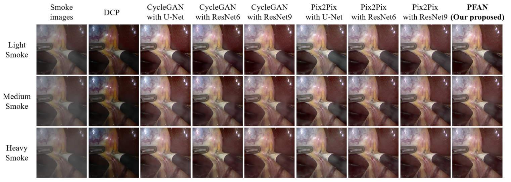

# Progressive Frequency-Aware Network for Laparoscopic Image Desmoking (PRCV2023)
[Jiale Zhang](https://github.com/jlzcode/), Wenfeng Huang, Xiangyun Liao, Qiong Wang

[Paper Available](https://arxiv.org/abs/2312.12023)


## Representative Results


## Overall Architecture


## Prerequisites
- Linux or macOS
- Python 3
- CPU or NVIDIA GPU + CUDA CuDNN

## Getting Started
### Installation

- Clone this repo:
```bash
git clone https://github.com/jlzcode/PFAN
cd PFAN
```

- Install [PyTorch](http://pytorch.org) and 0.4+ and other dependencies (e.g., torchvision, [visdom](https://github.com/facebookresearch/visdom) and [dominate](https://github.com/Knio/dominate)).
  - For pip users, please type the command `pip install -r requirements.txt`.
  - For Conda users, you can create a new Conda environment using `conda env create -f environment.yml`.


### Dataset


We used images from the [Cholec80](http://camma.u-strasbg.fr/datasets) dataset and sampled 1,500 images at 20-second intervals from videos, selecting 660 representative smoke-free images. As detailed above, we added synthetic random smoke, yielding 660 image pairs.

Composite Images [[Google Drive]](https://drive.google.com/file/d/1n_-AzgmQcUWt9VMkTvuZnewJXNHCB7_o/view?usp=drive_link)


### Train/Test
- Download the Composite Images dataset
- To view training results and loss plots, run `python -m visdom.server` and click the URL http://localhost:8097.
- To log training progress and test images to W&B dashboard, set the `--use_wandb` flag with train and test script
- Train a model(`sh ./scripts/train_pfan.sh`)::
```bash
python train.py --dataroot ./datasets/composite --name pfan
```

- Test the model (`bash ./scripts/test_pfan.sh`):
```bash
#!./scripts/test_pfan.sh
python test.py --dataroot ./datasets/composite --name pfan
```
- The test results will be saved to a html file here: `./results/pfan/test_latest/index.html`. You can find more scripts at `scripts` directory.


## Citation
If you find this work useful for you, please cite
```
@inproceedings{zhang2023progressive,
  title={Progressive Frequency-Aware Network for Laparoscopic Image Desmoking},
  author={Zhang, Jiale and Huang, Wenfeng and Liao, Xiangyun and Wang, Qiong},
  booktitle={Chinese Conference on Pattern Recognition and Computer Vision (PRCV)},
  pages={479--492},
  year={2023},
  organization={Springer}
}
```

## Acknowledgments
Our code is inspired by [pytorch-CycleGAN-and-pix2pix](https://github.com/junyanz/pytorch-CycleGAN-and-pix2pix).
